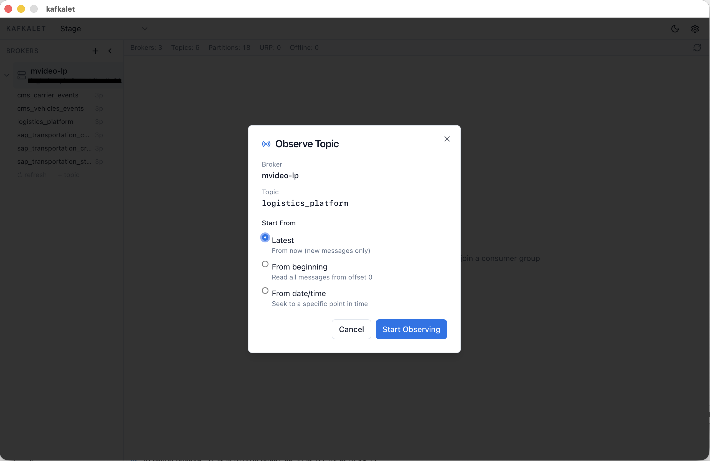
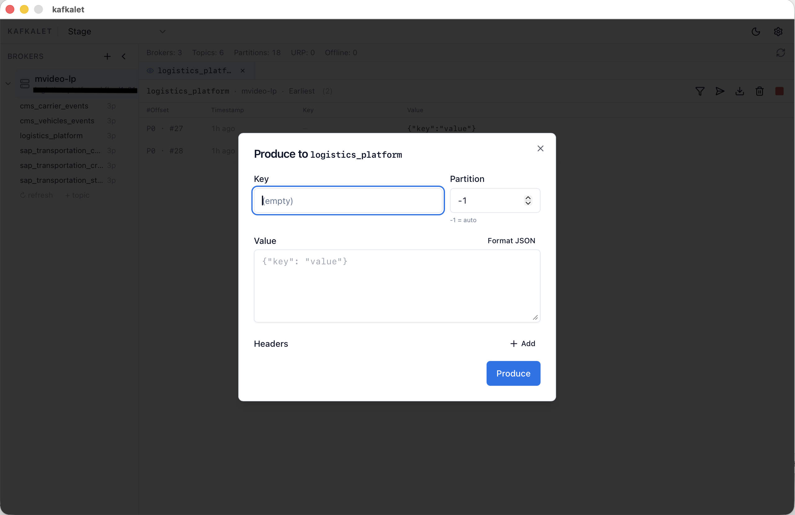
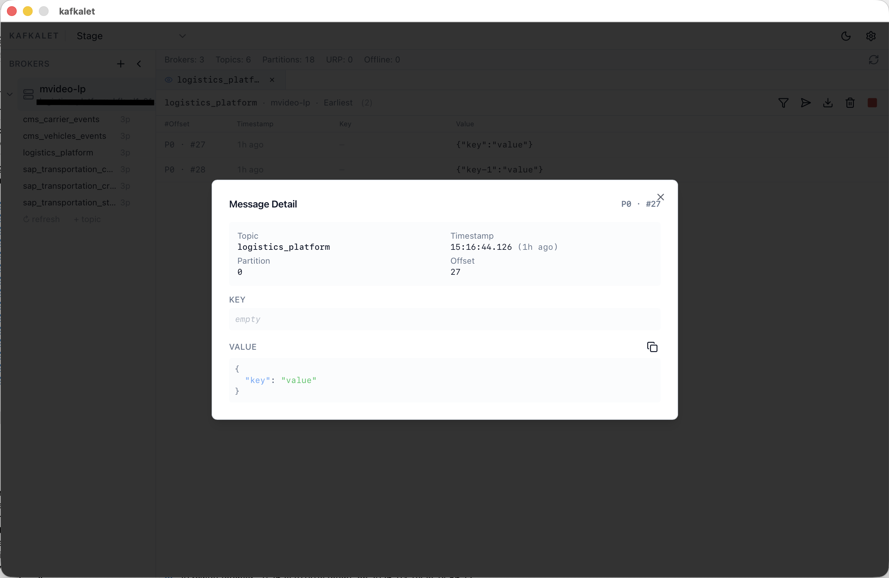
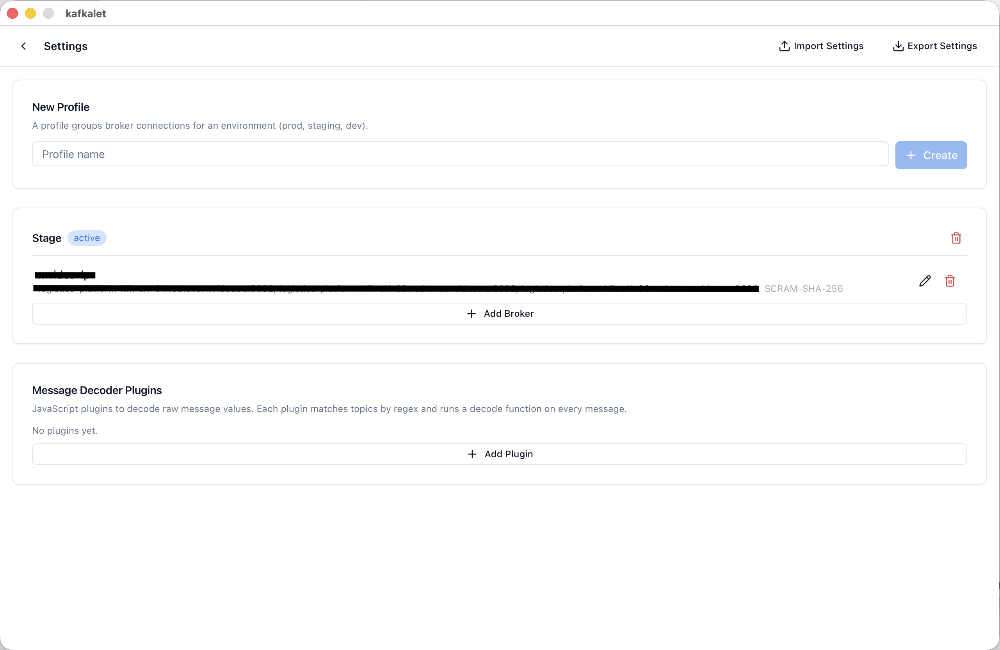

# kafkalet

> A desktop Kafka client for developers who want clarity, not complexity.

[](https://github.com/sneiko/kafkalet/actions/workflows/build.yml)


---

## Why kafkalet?

Most Kafka GUIs are heavy, slow, or require a running server. kafkalet is a **single self-contained binary (~15 MB)** that connects directly to your brokers.

| | kafkalet | Others |
|---|---|---|
| Install size | ~15 MB binary | 200–500 MB + JVM / Docker |
| Startup | Instant | 5–30 seconds |
| No side effects mode | **Observer** — reads without joining a group | Rare or absent |
| Credentials | OS keychain — never written to disk | Config files |
| Platforms | macOS · Windows · Linux | Often macOS/Linux only |

**No Docker. No JVM. No cloud account.**

---

## Features

**Stream messages in real time**
- **Observer mode** — read without joining a consumer group, zero side effects on your cluster
- **Consumer mode** — join a group and commit offsets when you're ready
- **Seek to timestamp** — jump to any point in topic history by wall-clock time
- **Live regex filter** — filter key/value while the stream is running
- **Multi-tab** — stream multiple topics side by side
- **Export** — save the message buffer to JSON or CSV
- **Virtualized list** — 50 000+ messages, no freezing

**Admin operations**
- Browse topics, partitions, leaders and in-sync replicas
- Create / delete topics; alter any topic config entry
- Consumer group lag per partition; reset offsets to earliest, latest, or timestamp
- Produce messages with key, value, headers, and target partition
- Cluster health: broker count, under-replicated and offline partitions

**Authentication — everything covered**
- SASL PLAIN · SCRAM-SHA-256/512 · OAUTHBEARER (static token & client credentials)
- TLS server verification · mTLS mutual certificates
- Passwords and tokens stored exclusively in the **OS keychain**

**Profile system**
- Group brokers by environment: `production`, `staging`, `dev`
- Multiple named credentials per broker — swap active credentials from the sidebar
- Hot-swap profiles in one click: streams stop, new profile connects automatically
- Import / export settings as JSON backup

**Extensibility**
- **Schema Registry** — automatic Avro decoding via Confluent Schema Registry
- **JS decoder plugins** — transform raw bytes for Protobuf, MessagePack, or any custom format

---

## Screenshots

### Observe a topic — choose your start position



Start from the latest offset, replay from the beginning, or seek directly to a date/time — without touching any consumer group offset.

---

### Produce a message



Send test messages with a custom key, JSON value, headers, and target partition directly from the stream view.

---

### Inspect every message in detail



Click any row to open the full message: topic, partition, offset, timestamp, key, and pretty-printed JSON value — with one-click copy.

---

### Manage profiles and brokers



Create profiles per environment, add brokers with full auth config, and install JavaScript decoder plugins — all in one place.

---

## Installation

Download the latest build from the [Releases](https://github.com/sneiko/kafkalet/releases) page.

| Platform | File | Notes |
|---|---|---|
| macOS (Apple Silicon) | `kafkalet-darwin-arm64.zip` | Drag `kafkalet.app` to Applications |
| macOS (Intel) | `kafkalet-darwin-amd64.zip` | Drag `kafkalet.app` to Applications |
| Windows | `kafkalet-windows-amd64-installer.exe` | Requires WebView2 (pre-installed on Win 11) |
| Linux | `kafkalet-linux-amd64.tar.gz` | See Linux notes below |

**macOS:** on first launch right-click → _Open_ if blocked by Gatekeeper.

**Linux dependencies:**
```bash
sudo apt-get install libgtk-3-0 libwebkit2gtk-4.0-37 libsecret-1-0
```

---

## Quick Start

1. Launch kafkalet — the main window opens with an empty sidebar.
2. Press **⌘,** (macOS) or **Ctrl+,** (Windows/Linux) to open Settings.
3. Click **New Profile**, name it (e.g. `Production`).
4. Click **Add Broker**, fill in the address and auth details, then **Test Connection**.
5. Save and close Settings. Your broker appears in the sidebar.
6. Expand the broker to see topics.
7. Click a topic → **Observe** (no group, no commits) or **Consume** (join a group).

**Keyboard shortcuts**

| Shortcut | Action |
|---|---|
| `⌘K` / `Ctrl+K` | Profile switcher |
| `⌘,` / `Ctrl+,` | Settings |

---

## Configuration

| Platform | Config location |
|---|---|
| macOS | `~/Library/Application Support/kafkalet/` |
| Windows | `%APPDATA%\kafkalet\` |
| Linux | `~/.config/kafkalet/` |

`profiles.json` stores broker addresses, SASL usernames, and TLS settings. Passwords are stored exclusively in the OS keychain and are **never** written to `profiles.json`.

---

## Building from Source

**Prerequisites:** Go 1.24+, Node.js 18+, Wails CLI

```bash
go install github.com/wailsapp/wails/v2/cmd/wails@latest
```

**macOS:** `xcode-select --install`
**Linux:** `sudo apt-get install libgtk-3-dev libwebkit2gtk-4.0-dev libsecret-1-dev`

```bash
git clone https://github.com/sneiko/kafkalet.git
cd kafkalet
wails dev          # development with hot reload
wails build        # production build for current platform
```

Cross-compile targets:

```bash
wails build -platform darwin/universal    # macOS universal binary
wails build -platform windows/amd64 -nsis # Windows installer
wails build -platform linux/amd64
```

Output lands in `build/bin/`.

---

## Tech Stack

| Layer | Technology |
|---|---|
| Native window & RPC bridge | [Wails v2](https://wails.io) |
| Kafka client | [franz-go](https://github.com/twmb/franz-go) |
| Schema Registry / Avro | [goavro](https://github.com/linkedin/goavro) |
| OS keychain | [go-keyring](https://github.com/zalando/go-keyring) |
| UI components | [shadcn/ui](https://ui.shadcn.com/) + Tailwind CSS |
| State management | [Zustand](https://github.com/pmndrs/zustand) |
| Frontend build | Vite + React 18 + TypeScript |
| List virtualisation | [@tanstack/react-virtual](https://tanstack.com/virtual) |

---

## Contributing

Pull requests are welcome. For larger changes please open an issue first.

After changing public methods on the `App` struct, regenerate TypeScript bindings:

```bash
wails generate module
```

---

## License

[MIT](LICENSE)
